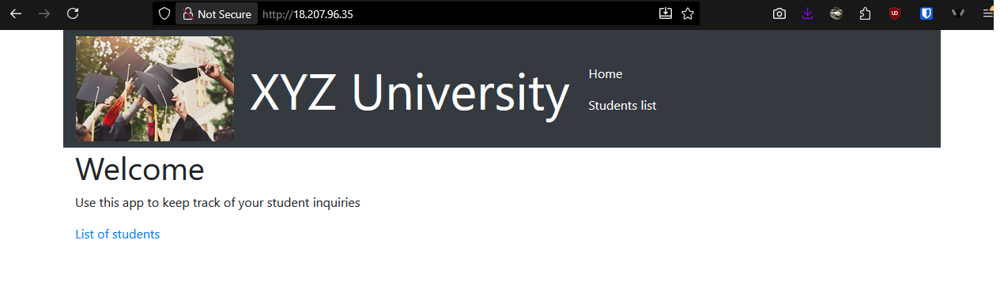
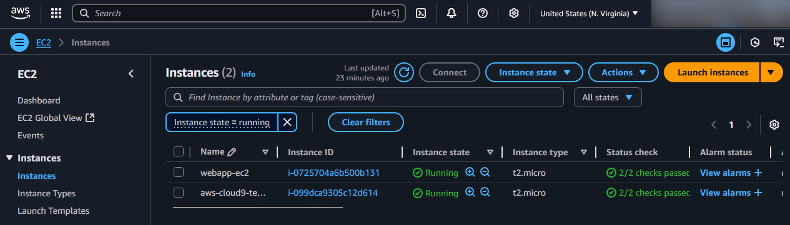
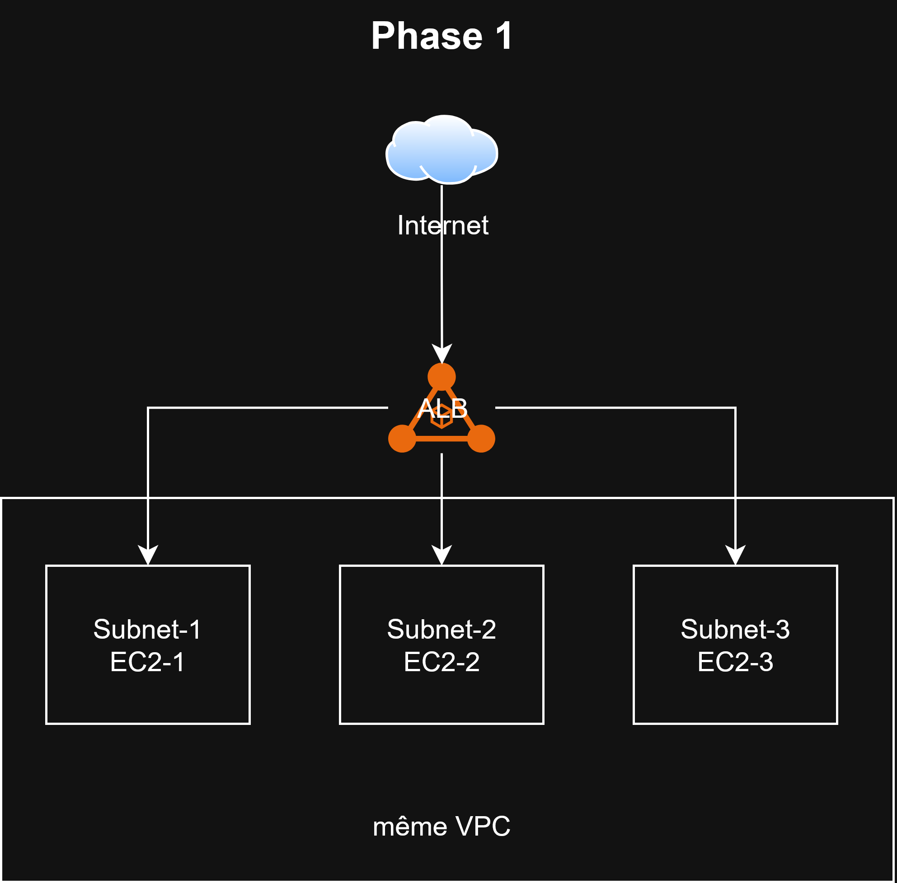

# 🌐 Phase 1 – Infrastructure réseau AWS avec Terraform

## Objectif

L’objectif de cette première phase est d’automatiser le déploiement d’une infrastructure réseau sur **AWS** à l’aide de **Terraform**.  
Cette infrastructure constitue la base du futur environnement applicatif et permettra de valider le bon fonctionnement des ressources réseau, des instances et du load balancer.

---

## Architecture mise en place

L’architecture repose sur plusieurs ressources AWS déployées automatiquement :

- **1 VPC** nommé `main-vpc`
- **3 sous-réseaux** créés automatiquement via `for_each` à partir de `locals.networks`
- **1 Internet Gateway** pour permettre l’accès public aux instances
- **1 Security Group** autorisant le trafic HTTP (port 80) et SSH (port 22)
- **3 instances EC2 Ubuntu** (une par sous-réseau)
- **1 Load Balancer (ALB)** redirigeant le trafic entrant vers les instances

---

## Structure des fichiers Terraform

Le projet est organisé en plusieurs fichiers pour une meilleure lisibilité :

terraform-aws-lb/
│
├── main.tf # Provider AWS + backend
├── networks.tf # VPC, subnets, Internet Gateway
├── instances.tf # Security Group + Instances EC2
├── loadbalancer.tf # Load Balancer et attachements
├── variables.tf # Déclaration des variables
└── terraform.tfvars # Valeurs des variables

---

## Choix techniques

| Élément | Description |
|----------|-------------|
| **Provider AWS** | Région `us-east-1` (imposée par l’environnement AWS Educate) |
| **Sous-réseaux** | Créés via un `for_each` sur `locals.networks` |
| **AMI Ubuntu** | Recherche via un bloc `data "aws_ami"` pour obtenir la dernière version compatible `x86_64` |
| **Security Group** | Autorise HTTP (80) et SSH (22) |
| **Load Balancer** | Attachement dynamique des instances via un bloc `dynamic` |
| **Organisation** | Séparation du code par fonctionnalités (réseau, instances, load balancer) |

---

## Fonctionnement

## 🚧 Difficultés rencontrées

-  **Erreur `InvalidKeyPair.NotFound`** : corrigée en créant la clé `universite-key` dans la console AWS.  
-  **Erreur ASCII dans la description du Security Group** : les caractères accentués ont été supprimés.  
-  **Région AWS figée (us-east-1)** : les ressources ont été adaptées à cette contrainte.

---

##  Résultats obtenus

- Le plan Terraform (`terraform plan`) montre la création correcte de toutes les ressources.  
- Après `terraform apply`, les **instances EC2** sont bien créées et accessibles.  
- Le **Load Balancer** distribue correctement le trafic HTTP entre les trois serveurs.

---

##  Schéma d’architecture

Légende :

    VPC : réseau principal

    3 sous-réseaux : un par zone de disponibilité

    Internet Gateway : connecte le VPC à Internet

    Load Balancer (ALB) : répartit le trafic HTTP sur les instances

    Security Group : autorise SSH (22) et HTTP (80)

 Conclusion

Cette première phase a permis de :

    Déployer automatiquement une infrastructure AWS complète et fonctionnelle,

    Mettre en pratique les concepts de modularité (for_each, locals, data),

    Poser les bases du déploiement automatisé pour les phases suivantes.

Terraform a prouvé ici son efficacité pour la reproductibilité, la clarté du code et la scalabilité des environnements cloud.